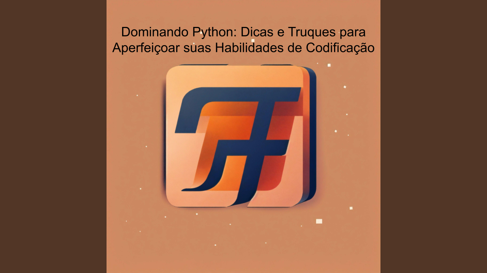

# Título
Dominando Python: Dicas e Truques para Aperfeiçoar suas Habilidades de Codificação

# Explorando o Mundo do Back-end com Python

Olá, pessoal! Hoje vamos mergulhar no mundo do back-end, uma parte importante da programação que lida com o lado "oculto" das aplicações web. E a ferramenta que vamos usar para isso é o Python, uma linguagem de programação super poderosa!

# O que é Back-end?

Então, imagine que você está jogando um jogo online. Você clica em um botão para atacar um monstro e o monstro fica mais fraco ou some, certo? Bem, o que acontece nos bastidores, onde os dados são salvos e processados, é o back-end! É como a cozinha de um restaurante: é onde a mágica acontece, mas você não vê.

# Por que Usar Python no Back-end?

Agora, por que escolher Python para trabalhar no back-end? Bem, Python é como uma varinha mágica para os programadores! É fácil de aprender, tem uma comunidade enorme e toneladas de bibliotecas prontas para usar. Quer construir um site ou um aplicativo? Python tem sua magia para isso!

# Flask e Django: Amigos do Back-end em Python

Agora, vamos falar sobre dois amigos muito legais que você pode usar com Python no back-end: Flask e Django. Imagine Flask como uma bicicleta: é leve, ágil e ótima para projetos menores. Já o Django é como um carro esportivo: tem muitas ferramentas embutidas e é perfeito para grandes projetos!

# Criando APIs com Python

Sabe quando você pede pizza pelo celular? Você faz o pedido, e em pouco tempo, a pizza chega na sua porta. Isso é como uma API funciona! Com Python, podemos criar APIs poderosas que permitem que diferentes partes de um programa se comuniquem, como mágica!

# Segurança no Back-end com Python

A segurança é muito importante, até mesmo no mundo da programação. Python nos dá ferramentas para proteger nossas aplicações web contra hackers e problemas de segurança. É como uma armadura mágica que mantém nossos castelos (ou sites) seguros dos vilões!

# Conclusão: Explore e Divirta-se!

Então, pessoal, exploramos o fascinante mundo do back-end com Python! Lembre-se, o back-end é como o coração das aplicações web, e Python é uma ferramenta poderosa para tornar isso possível. Então, continue explorando, aprendendo e se divertindo enquanto constrói coisas incríveis com Python!
